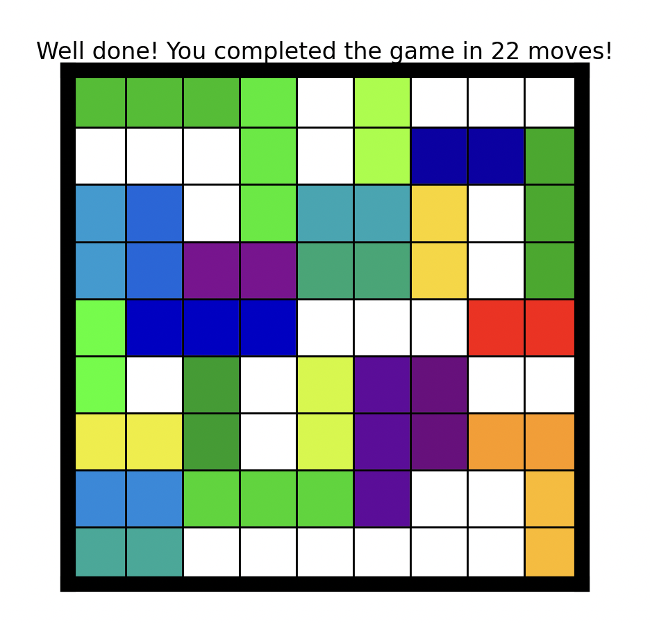

# Gas

## Introduction
Welcome to the Rush Hour project! This project focuses on solving Rush Hour puzzles using various algorithms and strategies.

Rush Hour is a puzzle game where the aim is to navigate a red car off the board by sliding other vehicles that obstruct its path. Vehicles can only be moved horizontally or vertically along their respective rows, and the red car can only exit in a straight line. One move consist out if any empty blocks that. 

## Case Introduction

In this project, we tackle solving various Rush Hour boards:

* Board 1 to 3: These are 6 by 6 boards.
* Board 4 to 6: These are 9 by 9 boards and are more challenging.
* Board 7: This is a 12 by 12 board and is very challenging, requiring efficient solution algorithms.

To solve the boards, we implemented the following rule:

* Each vehicle can move within its lane provided it is not blocked by another vehicle.
* If there are multiple consecutive empty spaces in front of or behind a vehicle, it can move through all these spaces in a single move.

<div style="display: flex; flex-wrap: wrap;">
  
  
</div>

## Algorithm Descriptions for Solving Rush Hour Boards
#### Random
The Random algorithm makes random moves with random cars without any strategic consideration. This approach can be used as a baseline to compare the effectiveness of more sophisticated strategies.

#### Random with Heuristics
The Random with Heuristics algorithm builds on the random approach by incorporating simple heuristics to avoid repetitive or counterproductive moves:

1. **Avoid Moving the Same Car Back and Forth:** This prevents a car from being moved to a position and then immediately moved back to its original position, which would waste moves and make no progress.
2. **Move the Red Car to the Exit When Path is Clear:** If the path is free of vehicles, the algorithm will immediately move the red car to the exit. This ensures a quick solution when the opportunity arises.

#### Breadth-First Search
Breadth-First Search (BFS) is a systematic approach to explore all possible moves from the initial state:

1. **Explore All Possible Moves:** Starting from the initial board configuration, BFS explores all possible single moves.
2. **Prevent Repeating States:** TTo avoid cycles and unnecessary computations, it keeps track of already visited board states.
3. **Layer-by-Layer Search:** It explores moves level by level, ensuring the shortest path to the solution is found if it exists.

#### Beam Search
Beam Search is a heuristic-driven search algorithm that explores the search space more selectively than BFS:

1. Score-Based Evaluation: Each board state is assigned a score based on a set of heuristics.
    * **Distance of Red Car from Exit:** The further the red car is from the exit, the higher the score, encouraging moves that bring the red car closer to the exit.
    * **Blocking Cars**: The more cars blocking the exit, the lower the score, prioritizing moves that reduce the number of blocking cars.
    * **Empty Spaces Around Blocking Cars:** IIf blocking cars have more empty spaces around them, the score is higher, as these cars can potentially be moved out of the way more easily.
    * **Movement Efficiency:** TThe score is adjusted based on the movement of the last moved car relative to the average movement of all cars.
2. Unlike BFS, Beam Search limits the number of states it examines at each level to a fixed number (the beam width). This means only the highest-scoring states are considered for further exploration. By focusing on the most promising states, Beam Search balances the depth and breadth of the search, making it more computationally efficient without losing sight of potential solutions.

## Implementation
We have developed a Python implementation for Rush Hour, utilizing a board representation and different search algorithms to find solutions. Below is how you can set up and run the project:

## Installation

1. Clone de repository:
```bash
git clone https://github.com/deffie2/Gas.git
```
2. Installeer de vereiste pakketten:
```bash
python3 -m pip install -r requirements.txt
```
## Running the Algorithms

For our project, we utilized the following algorithms: Random (R), Random with heuristics (RH), Breadth First Search (BFS), and Beam Search (BS). Here's a detailed guide on how to effectively run these algorithms and store results:

#### Explantion of `main.py`
The script `main.py` is designed to execute different algorithms based on command-line arguments. Here’s how it works:
##### Command Line Arguments
The script expects the following arguments to be passed when executing for the algorithms:
```bash
python3 main.py <game_number> <d> <algorithm> <runs> <shortest_path>
```
* `<game_number>`: Specifies the board configuration to run the algorithm on. There are 7 boards numbered sequentially from 1 to 7.
* `<d>`: Represents the dimension of the board.
    * Boards 1 to 3 have `d = 6`.
    * Boards 4 to 6 have `d = 9`.
    * Board 7 has `d = 12`.
* `<algorithm>`: Identifies the algorithm to execute:
    * `r` for Random.
    * `rh` for Random with heuristics.
    * `bf` for Breadth First Search.
    * `bs` for Beam Search.
* `<runs>`: Specifies the number of times the algorithm will be executed. Must be a positive integer.
* `<shortest_path>`: Selecting `yes` allows you to view a simulation based on previous runs specific to that board configuration. Selecting `no` initiates a new run of the algorithm on the chosen board.

##### Example Usage
To illustrate, here’s how you would run each algorithm for board configurations:

* Random Algorithm (r)
    ```bash
    python3 main.py 1 6 r 5 no
    ```
    * Executes Random algorithm on board 1 (`game_number = 1`), dimension `d = 6`, for 5 runs and no shortest path simulation.

* Random with heuristics (rh)
    ```bash
    python3 main.py 7 12 rh 100 no
    ```
    * Executes Random with heuristics on board 7 (`game_number = 7`), dimension `d = 12`, for 100 runs and no shortest path simulation.

* Breadth First Search (bf)
    ```bash
    python3 main.py 5 9 bf 1 no
    ```
    * Executes BFS on board 5 (game_number = 5), dimension `d = 9`, for 1 run and no shortest path simulation.

* Beam Search (bs)
    ```bash
    python3 main.py 2 6 bs 1 no
    ```
    * Executes Beam Search on board 2 (`game_number = 2`), dimension `d = 6`, for 1 runs and no shortest path simulation.


## Visualization Only
Shortest_path can be set to `yes` or `no`. If set to `no`, the chosen algorithm is executed. After the algorithm finishes, a simulation will run. If you run `r` or `rh`, a frequency table of the total runs will also be generated. If set to `yes`, the script assumes the algorithm has been run previously and you wish to view the simulation of that solution. For `r`, `rh`, and `bs`, when choosing to run with yes, you will be prompted:
```bash
What is the name of the dataset you wish to access? 
``` 
Here, you will enter the complete file name, including `.csv`. For `bf`, you do not need to enter any file name.

##### Example of short path simualtion
```bash
python3 main.py 2 6 bs 1 yes
```
* Executes Beam Search on board 2 (`game_number = 2`), dimension `d = 6`, for 1 runs and shortest path simulation.

##### Explanation
* Argument Parsing: The script uses `sys.argv` to parse and interpret these command-line arguments.
* Algorithm Execution: Based on the specified algorithm (`r`, `rh`, `bf`, `bs`), the script initiates the corresponding algorithmic process.
* Shortest Path Simulation: When set to `yes`, you can view the simulation of the solving board. When set to `no`, the algorithm runs on the chosen board.
* Data Handling: Results from each run or iteration are typically stored in the appropriate directory under `data` for further analysis.


## Calculating Spate Space
By running this code, you can print all the calculated state spaces of the boards. The state space is the number of possible states a single board can occupy. A formula has been devised to calculate this state space, which you can learn more about in the presentation on 27/6/2024 or by examining the code itself. To find the state spaces, navigate to the `code` directory. 
```bash
python3 statespace.py
```
## Experiment setup
For these experiments, you need to run the bs (Beam Search) and the bf (Breadth First Search) algorithms. The instructions for running them in the terminal are described above in the "Running the Algorithms" section.

##### Note
During the execution of BS commands in this experiment, you will be prompted to enter both a beam width value and a heuristic weight-value.

When prompted during the beam search commands, follow these steps:
```arduino
What value would you like for the beam width? <enter beam width value>
```
Enter your desired integer value for the beam width.

```arduino
What heuristics weight-value would you like to test? <enter heuristic weight-value>
```
Enter your desired heuristic weight-value.

### Experiment 1
##### Objective
Evaluate the performance of breadth-first search (BFS) and beam search (BS) algorithms on boards of varying dimensions and configurations, aiming to identify beam widths for BS that achieve comparable move counts to BFS and finding the optimal beam width.

##### Conducting BFS and BS
Before excuting the BS and BF commands delete the `results_bs.csv` file and the `results_bf.csv` in the `Experiments` directory. 
Run the aforementioned BFS commands for each board. Subsequently, execute the BS commands for each board using the specified beam width options below and always set the heuristic weight value to 0.25.

##### Beam Width Selection
For beam search, select the following beam widths:
* Board 1: Try beam widths 50, 100, 200.
* Board 2: Try beam widths 50, 100, 200, 300, 400.
* Board 3: Try beam widths 100, 200, 300, 400, 500.

##### Visualization
After running each commands for BFS and BS, the results including the number of board states, moves, and the chosen beam width will be saved in a CSV file for each board. This CSV file can then be used to visualize and compare the performance of BFS and BS across different beam widths for each board. 

##### Generating Graphs
To generate graphs from the CSV files, follow these steps:
##### Step 1: Generate BS Graphs
1. Navigate to the `Experiments` directory.
2. Execute the following command in the terminal:
```bash
python3 graphs_for_ex1.py
```
These scripts will automatically process data from the CSV files to produce graphs for analysis.

### Experiment 2
Objective: We want to test if a specific heuristic actually creates better results. This will be tested by varying the weights for this heuristic from 0 to 0.5 in increments of 0.125. The heuristic we want to check, checks the relativity of the amount of the car that has just moved, with the average amount of moves of all cars. If the car that just moved, moved more that the average moves of all cars, the total score gets lower for this board. The lower the score the less chance the board will be selected. 

##### Conducting BS
Before excuting the BS commands delete the `results_bs.csv` file in the `Experiments` directory. 
Then Run the aforementioned BS commands for each board using a beam width of 100 and the heuristic weight-value options below.

##### Heuristic weight-value
For beam search, evalute the following heuristic weight-value:
* Board 1: Try 0, 0.125, 0.25, 0.375, 0.5.
* Board 2: Try 0, 0.125, 0.25, 0.375, 0.5.
* Board 3: Try 0, 0.125, 0.25, 0.375, 0.5.

##### Visualization
After excuting each BS command, the results including the number of board states, moves, chosen beam width and heuristic weight-value will be saved in a CSV file for each board. This CSV file can then be used to visualize and compare the performance of BS with different heuristic weight-values for each board. 

##### Generating Graphs
To generate graphs from the CSV files, follow these steps:
##### Step 1: Generate BS Graphs
1. Navigate to the `Experiments` directory.
2. Execute the following command in the terminal:
```bash
python3 graphs_for_ex2.py
```
These scripts will automatically process data from the CSV files to produce graphs for analysis.

## Structure
The following list describes the main directories and files in the project, and where you can find them:

* /code: contains all the code for this project
    * /code/algorithms: contains the code for the algorithms and heuristics used.
    * /code/classes: contains the classes used for this case.
    * /code/visualisation: contains the code to visualize all the graphs and simulations.
    * /code/statespace.py: contains the code to calculate the state space.
* /data: contains various data files needed to visualize the graph plots and the simulation of the board solution.
* /Experiment: contains the code to plot the graphs for the experiments.
* /Foto: contains photos that were uploaded to the project on Git.

## Actors
* Charlotte Dasselaar
* Deveney Etnel
* Zenna Liekens

